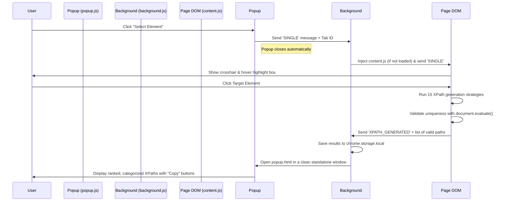

# SmartPath XPath Generator 🚀

**SmartPath** is a modern, developer-centric Chrome Extension designed to generate highly stable, context-aware, and precise XPath selectors for web elements. Instead of relying on brittle absolute paths or single-strategy locators, SmartPath evaluates the DOM context using **15 distinct fallback strategies** and integrates **on-device AI (Gemini Nano)** to generate reliable selectors that survive page redesigns.

---

## 🛠️ Architecture & Technology Stack

SmartPath is built entirely with modern web technologies and the Chrome Extension API, avoiding heavy frameworks to maintain a near-zero performance footprint.

### 1. Technology Stack
* **Frontend UI**: Vanilla HTML5 & CSS3. The UI follows modern design guidelines (dark mode, glassmorphism-inspired components, active state micro-animations, and clean typography).
* **Core Logic**: Vanilla JavaScript (ES6+).
* **XPath Engine**: DOM Level 3 XPath specification (`document.evaluate` used for real-time uniqueness validation).
* **On-Device AI**: Integration with Google's on-device LLM (**Gemini Nano**) via the Chrome experimental `window.ai.languageModel` / `chrome.aiOriginTrial.languageModel` Prompt APIs.

### 2. Extension Architecture (Manifest V3)
* **`manifest.json`**: Configures Manifest V3, specifies active permissions (`activeTab`, `tabs`, `scripting`, `storage`), and registers UI entry points.
* **Popup (`popup.html` / `popup.css` / `popup.js`)**: Coordinates user selection, displays the list of generated XPath cards categorized by stability level, and handles copy-to-clipboard interactions.
* **Background Worker (`background.js`)**: Orchestrates communications between the popup and content scripts. Dynamically injects the content script on request and handles storage and window states.
* **Content Script (`content.js`)**: Injected into the target web page. Manages the selection overlay highlight UI, listens for element clicks, runs the XPath generation strategies, and evaluates uniqueness directly in the tab's DOM context.

---

## 🔍 How It Works (Step-by-Step)



1. **Activation**: The user opens the extension popup and clicks the selector icon.
2. **Dynamic Overlay**: The popup closes, and the content script applies a `crosshair` cursor and a smooth blue highlight box over elements as the user hovers over the page.
3. **Selection**: When the user clicks an element, default click actions are intercepted. The script captures the target DOM element and immediately terminates selection mode.
4. **Strategy Pipeline**: The element is passed through 15 different XPath extraction functions. Each candidate XPath is checked in the browser's DOM namespace using `document.evaluate()`. If a candidate returns exactly 1 match (the selected element itself), it is accepted.
5. **On-Device AI Processing**: If Gemini Nano is enabled, a localized segment of the surrounding HTML DOM tree is serialized and sent to the local model to draft a robust semantic locator.
6. **Presentation**: The background script stores the final list in `chrome.storage.local` and launches `popup.html` as a clean, custom-sized floating panel. XPaths are grouped, ranked, and color-coded by their stability (**High**, **Medium**, **Low**).

---

## 📋 The 15 XPath Generation Strategies

SmartPath evaluates the target element against the following hierarchy, ordered from most stable to least stable:

| # | Strategy Name | Stability | Description & Logic | Example Output |
|---|---|---|---|---|
| **1** | **ID** | **High** | Uses a unique, static `id` attribute. | `//*[@id="submit-btn"]` |
| **2** | **Data-\* Attribute** | **High** | Prioritizes QA-specific test locators (`data-testid`, `data-test`, `data-qa`, etc.). | `//button[@data-testid="login-submit"]` |
| **3** | **Semantic Attribute** | **High** | Looks for attributes like `name`, `placeholder`, `aria-label`, `title`, or `alt`. | `//input[@placeholder="Search..."]` |
| **4** | **Text (normalize-space)** | **Medium** | Matches exact text inside the element, stripping outer whitespace. | `//a[normalize-space()="Learn More"]` |
| **5** | **Label Relationship** | **Medium** | Navigates to inputs via label associations (`for` attributes, parents, or nearby label siblings). | `//label[normalize-space()="Email"]/following-sibling::input[1]` |
| **6** | **Combined Attributes** | **Medium** | Joins multiple non-unique attributes using the `and` operator to guarantee precision. | `//input[@type="checkbox" and @name="agree"]` |
| **7** | **Partial Match (contains)** | **Medium** | Matches subsegments of attributes, stripping dynamic numbers or hashes. | `//div[contains(@id, "user-profile-")]` |
| **8** | **Prefix Match (starts-with)** | **Medium** | Matches the beginning of attributes using `starts-with()`. | `//button[starts-with(@id, "btn-")]` |
| **9** | **Sibling Axis** | **Medium** | References a nearby unique sibling and navigates to the target. | `//h2[@id="section-1"]/following-sibling::p[1]` |
| **10** | **Parent Anchor** | **Medium** | Resolves an element using its parent's unique selector. | `//*[@id="nav-menu"]/li[3]` |
| **11** | **Ancestor Anchor** | **Medium** | Climbs up to 5 levels to find an anchor ancestor, then uses descendant navigation. | `//*[@id="form-wrapper"]//input[@type="submit"]` |
| **12** | **Unique Attribute** | **Medium** | Brute-force evaluates every custom or framework attribute on the element. | `//div[@role="tooltip"]` |
| **13** | **CSS Class (contains)** | **Low** | Evaluates individual class names (sorted longest-first) in case of non-standard structures. | `//span[contains(@class, "card-title")]` |
| **14** | **AI Generated (Gemini Nano)** | **Medium** | Leverages local AI to draft semantic paths based on local context. | *Varies (e.g., custom semantic axes)* |
| **15** | **Absolute Path** | **Low** | Last-resort fallback mapping the full structural tree. Highly prone to breakage. | `/html/body/div[2]/div[1]/main/form/input[1]` |

---

## 🤖 Configuring On-Device AI (Gemini Nano)

To utilize the **AI Generated** strategy, your Chrome browser must have on-device AI enabled. 

### Prerequisites & Setup
1. **Chrome Version**: Use Google Chrome version **127 or higher** (Chrome Canary or Dev channel is recommended for the latest implementations).
2. **Enable Flags**:
   * Open Chrome and navigate to `chrome://flags`.
   * Search for **"Enables optimization guide on device"** and set it to **Enabled BypassPerfRequirement** (or **Enabled**).
   * Search for **"Prompt API for Gemini Nano"** and set it to **Enabled**.
3. **Relaunch**: Click the **Relaunch** button at the bottom of the page to apply settings.
4. **Download the Model**:
   * Open the Chrome Developer Tools Console on any page.
   * Run: `await ai.languageModel.capabilities();`
   * Check `chrome://components` and look for **"Optimization Guide On Device Model"**. If it is present, ensure it is fully updated (status should read "Up-to-date"). If it shows `0.0.0.0`, wait a few minutes for Chrome to download the model in the background.

Once configured, the extension will automatically attempt to call Gemini Nano to produce intelligent semantic fallback XPaths.

---

## 🚀 Installation & Developer Setup

1. **Clone/Download** the repository to your local machine:
   ```bash
   git clone <repository-url>
   ```
2. **Open Extensions Page**:
   * In Google Chrome, go to `chrome://extensions`.
3. **Enable Developer Mode**:
   * Toggle the **Developer mode** switch in the top right corner to ON.
4. **Load Unpacked Extension**:
   * Click the **Load unpacked** button in the top left.
   * Select the root directory containing the extension files (`smart-path` folder containing `manifest.json`).
5. **Start Selecting**:
   * Pin **SmartPath** to your Chrome toolbar.
   * Navigate to any webpage (e.g., [Google](https://google.com)) and click the selector icon.

---

*Made with ❤️ by Kumar Priyank*